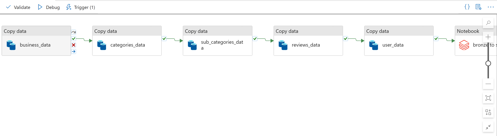
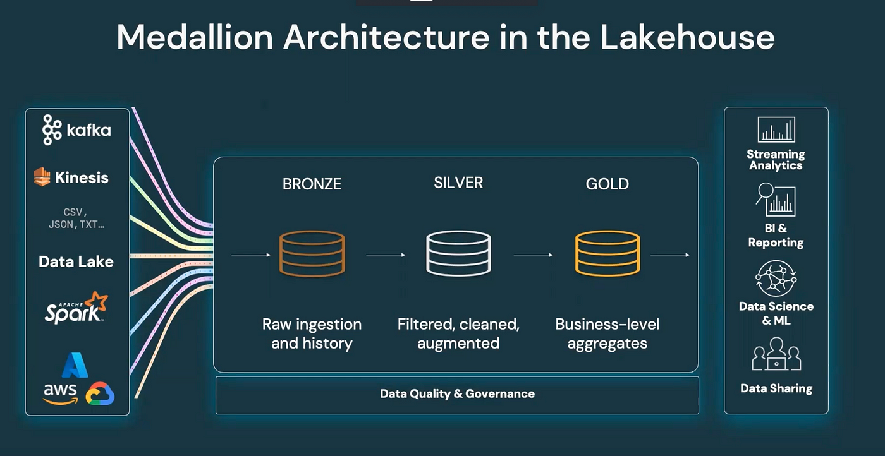

# 🛍️ Parrot Social Commerce Platform – End-to-End Data Engineering & Analytics

This project showcases a full-scale data engineering and analytics solution for **Parrot**, a social commerce platform. The pipeline integrates multiple tools across the Azure ecosystem, leveraging Medallion architecture (Bronze, Silver, Gold) for scalable, maintainable data processing and reporting.

---

## 📌 Project Overview

**Objective:**  
To design and deploy a scalable data pipeline that extracts data from MongoDB, transforms it using PySpark in Databricks, and delivers analytics-ready data to Power BI through Azure Synapse for real-time business intelligence.

---

## 🧱 Tech Stack

| Tool/Platform          | Purpose                                          |
|------------------------|--------------------------------------------------|
| `MongoDB`              | Source database                                  |
| `Azure Data Factory`   | Data ingestion (Copy Activities)                 |
| `Azure Data Lake Gen2` | Raw and curated data storage                     |
| `Azure Databricks`     | Data transformation using PySpark                |
| `Medallion Architecture` | Bronze, Silver, Gold layer architecture        |
| `Azure Synapse Analytics` | External tables, stored procedures & views    |
| `Power BI`             | Reporting and dashboarding                       |

---

## 🗃️ Data Flow Architecture

---

## 📂 Medallion Architecture

### 🥉 Bronze Layer:
- Raw JSON data extracted from MongoDB.
- Stored in ADLS Gen2.
- Ingested using Azure Data Factory.

### 🥈 Silver Layer:
- Data cleaned and normalized using PySpark in Azure Databricks.
- Converted to Parquet for optimized storage and querying.

### 🥇 Gold Layer:
- Aggregated and business-ready data prepared for analytics.
- Partitioned and optimized for external table creation.

---

## 🔧 Setup Steps

### 1. **Data Ingestion (ADF)**
- Use **Copy Activity** in Azure Data Factory to extract JSON from MongoDB.
- Destination: ADLS Gen2 → `/bronze/parrot/`

### 2. **Transformation (Databricks & PySpark)**
- Mount ADLS storage in Databricks.
- Use PySpark to:
  - Flatten nested JSON
  - Remove nulls and duplicates
  - Format dates and keys
- Store cleaned data to:
  - `/silver/parrot/` (intermediate)
  - `/gold/parrot/` (analytics-ready)

### 3. **Data Modeling (Synapse Analytics)**
- Connect to Gold layer in ADLS Gen2 using Synapse.
- Create **stored procedures**:
  - One to create SQL views from Parquet files
  - Another to generate **external tables** for reporting

---
### 4. **Analytics & Reporting (Power BI)**
Connect Power BI Desktop to external tables from Synapse.

 - Build reports using:

* DAX Expressions

* Visual filters and slicers

* Time series and KPI analysis

* Publish reports to Power BI Service

* Schedule data refresh for real-time insights
